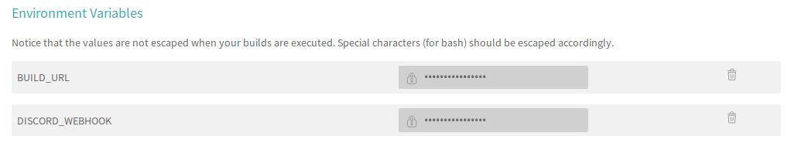

# Travis Discord
#### Post your Travis CI build results to Discord using Discord webhook

## Requirements
Requires `bash` and `curl` in the build environment.

## Instructions

1. Add a Discord webhook to your Discord guild, if you don't know what a webhook is, you can get started with [this page](https://support.discordapp.com/hc/en-us/articles/228383668-Intro-to-Webhooks).  
2. Add two environment variables in your Travis CI build project.  

      `BUILD_URL`: Url for your builds. For a public repo it will look like this: `https://travis-ci.org/OWNER/REPO/builds`, where `OWNER` is the repo owner name and `REPO` is the repo name.

      `DISCORD_WEBHOOK`: Url for your Discord webhook.

      To add the environment variables, go to your Travis CI project page and click on `More options -> settings`.  
      This is what your environment variables might look like.


3. Then simply add one line to `after_script` in your Travis CI build file.
```
bash -c "$(curl -fsSL https://raw.githubusercontent.com/MaT1g3R/travis_discord/master/travis.sh)"
```
Here's an example for a .travis.yml file:
```yml
language: python
python:
  - "3.6"
matrix:
  include:
    - os: linux
      dist: trusty
      sudo: required
before_install:
  - sudo apt-get update -qq
  - sudo apt-get install -qq libgeos*
  - sudo apt-get install -qq wget
install:
  - "pip install -r requirements.txt"
services:
  - postgresql
addons:
  postgresql: "9.6"
before_script:
  - "psql -c 'create database hifumi_testing;' -U postgres"
script: pytest
after_script:
    - bash -c "$(curl -fsSL https://raw.githubusercontent.com/MaT1g3R/travis_discord/master/travis.sh)"
```
